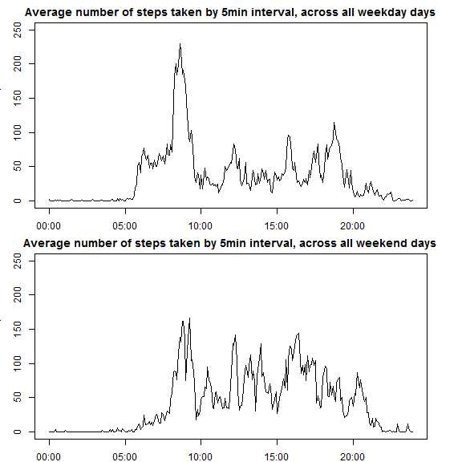

## Loading and preprocessing the data

```r
setwd("~/Data Science/Reproducible Research/Assignment1/RepData_PeerAssessment1")
unzip("activity.zip")
activity <- read.csv("activity.csv") #The default of na.strings = "NA" is what we want
```

###We need to correct for the "stretched" out interval times 
This is due to the gap between the 55th minute and the start of the next hour on the hundred. Otherwise 5min is stretched to look like 45min.  
To do this, we create a variable called **time**  
But first we need to put the interval variable into a hour/minute (%H%M) format by padding in 0s as appropriate  


```r
activity$tmpinterval[activity$interval < 10] <- paste("000", activity$interval[activity$interval < 10], sep="")
activity$tmpinterval[activity$interval >= 10 & activity$interval < 100] <- paste("00", activity$interval[activity$interval >= 10 & activity$interval < 100], sep="")
activity$tmpinterval[activity$interval >= 100 & activity$interval < 1000] <- paste("0", activity$interval[activity$interval >= 100 & activity$interval < 1000], sep="")
activity$tmpinterval[activity$interval >= 1000] <- activity$interval[activity$interval >= 1000]

activity$time <- as.POSIXct(paste("1970-01-01",activity$tmpinterval,sep=" "),"%Y-%m-%d %H%M", tz = "GMT")
activity$date <- as.Date(activity$date) #Change the date variable to be a proper date

activity$tmpinterval <- NULL #this is no longer needed
```

## What is mean total number of steps taken per day?

```r
steps_per_day <- setNames(aggregate(activity$steps, by=list(activity$date), FUN = sum), c("day","steps"))
hist(steps_per_day$steps)
```

 

```r
mean(steps_per_day$steps, na.rm = TRUE)
```

```
## [1] 10766.19
```

```r
median(steps_per_day$steps, na.rm = TRUE)
```

```
## [1] 10765
```

## What is the average daily activity pattern?

```r
steps_per_5min_time <- setNames(aggregate(activity$steps, by=list(activity$time), FUN = mean, na.rm = TRUE), c("time","steps"))

steps_per_5min_interval <- setNames(aggregate(activity$steps, by=list(activity$interval), FUN = mean, na.rm = TRUE), c("interval","steps")) #used to show the "strechting effect"

plot(steps_per_5min_time, type = "l", main = "Average number of steps taken by 5min interval, across all days", xlab = "
     time of day")
```

 

This next plot is for comparision to show the stretched out values between 55 and 100

```r
plot(steps_per_5min_interval, type = "l", main = "Average number of steps taken by 5min interval,  across all days", xlab = "interval - showing stretch between the 55 and hundred values")
```

 

The 5-minute interval that contains the maximum number of steps is 08:35
with the maximum number of steps being 206.1698113

## Imputing missing values
The total number of missing step values is the same as the total number of missing values, so the only missing values are in the steps variable:

```r
length(which(is.na(activity$steps)))
```

```
## [1] 2304
```

```r
length(which(is.na(activity)))
```

```
## [1] 2304
```

```r
#Prove that the steps are missing for whole days, i.e. not partial NAs for any given day
unique(activity$date[is.na(activity)]) #these are the days that have missing values
```

```
## [1] "2012-10-01" "2012-10-08" "2012-11-01" "2012-11-04" "2012-11-09"
## [6] "2012-11-10" "2012-11-14" "2012-11-30"
```

```r
unique(activity$steps[activity$date %in% unique(activity$date[is.na(activity)])]) #there are no non NA values for these days that have missing values
```

```
## [1] NA
```

```r
activity_no_na <- activity #copy the activity data to our new dataset
activity_no_na$steps[is.na(activity_no_na$steps)] <- rep(steps_per_5min_time$steps, length(unique(activity_no_na$date[is.na(activity_no_na)]))) #the strategy to fill in the missing values is to use the mean for that 5-minute interval - this is already in steps_per_5min_time, so we repeat it for each of the 8 days that have all their data missing

steps_per_day_no_na <- setNames(aggregate(activity_no_na$steps, by=list(activity_no_na$date), FUN = sum), c("day","steps")) #create a new dataset of the aggregate sum of the steps per day

par(mfrow = c(1, 2))
hist(steps_per_day$steps, ylim=c(0, 35), main = "Histogram: with NAs")
hist(steps_per_day_no_na$steps, ylim=c(0, 35), main = "Histogram: without NAs")
```

 

```r
mean(steps_per_day_no_na$steps)
```

```
## [1] 10766.19
```

```r
median(steps_per_day_no_na$steps)
```

```
## [1] 10766.19
```

```r
steps_per_day_no_na$steps[order(steps_per_day_no_na$steps)]
```

```
##  [1]    41.00   126.00  2492.00  3219.00  4472.00  5018.00  5441.00
##  [8]  6778.00  7047.00  7336.00  8334.00  8355.00  8821.00  8841.00
## [15]  8918.00  9819.00  9900.00 10056.00 10119.00 10139.00 10183.00
## [22] 10304.00 10395.00 10439.00 10571.00 10600.00 10765.00 10766.19
## [29] 10766.19 10766.19 10766.19 10766.19 10766.19 10766.19 10766.19
## [36] 11015.00 11162.00 11352.00 11458.00 11829.00 11834.00 12116.00
## [43] 12426.00 12608.00 12787.00 12811.00 12883.00 13294.00 13452.00
## [50] 13460.00 13646.00 14339.00 14478.00 15084.00 15098.00 15110.00
## [57] 15414.00 15420.00 17382.00 20427.00 21194.00
```
The mean is the same as previously since we have added the mean values into the previously missing values. The median has changed, it is now equal to the mean since these 8 mean values were added, these can be seen in the ordered list of the number of steps per day.

## Are there differences in activity patterns between weekdays and weekends?

```r
activity_no_na$weekde[weekdays(activity_no_na$date) %in% c("Monday", "Tuesday", "Wednesday", "Thursday", "Friday")] <- "weekday"
activity_no_na$weekde[weekdays(activity_no_na$date) %in% c( "Saturday", "Sunday")] <- "weekend"
activity_no_na$weekde <- factor(activity_no_na$weekde, levels = c("weekday","weekend"))

avg_steps_per_weekde_time <- setNames(aggregate(activity_no_na$steps, by=list(activity_no_na$weekde, activity_no_na$time), FUN = mean), c("weekde","time","steps"))

par(mfrow = c(2, 1), mar = c(2, 2, 2, 2), oma = c(0, 0, 0, 0))

with(subset(avg_steps_per_weekde_time, weekde=="weekday"), plot(steps ~ time, type = "l", main = "Average number of steps taken by 5min interval, across all weekday days", xlab = "time of day", ylab = "number of steps", ylim=c(0, 250)))

with(subset(avg_steps_per_weekde_time, weekde=="weekend"), plot(steps ~ time, type = "l", main = "Average number of steps taken by 5min interval, across all weekend days", xlab = "time of day", ylab = "number of steps", ylim=c(0, 250)))
```

 
